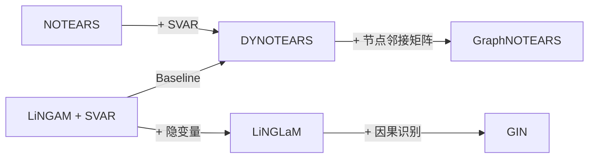

# 兔兔的科研Github
## 论文
> + NOTEARS
> > *NIPS2018，无环约束开山之作*
> + DYNOTEARS 
> >*2020，将NOTEARS扩展至动态图，融入了时间属性*
> + GraphNOTEARS 
> > *AAAI2023，Score-based的动态图NOTEARS*
## 代码
> + GraphNOTEARS-main 
> > *包含了NOTEARS、DYNOTEARS等Baselines的实现，Pytorch实现*
> + ICML22
> >  *可能的启发性ICML22文章*
  
## 思路

